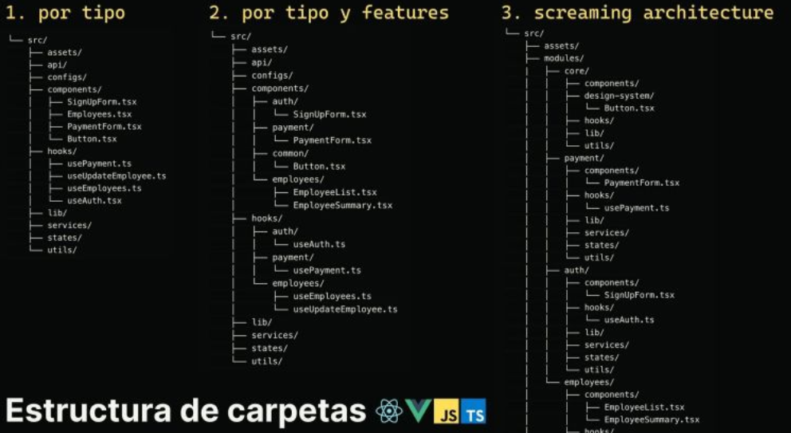

# FULP - Escuela de Programadores III 
## Taller Competencias más demandadas en el Mercado Laboral Tecnológico

### Programa de mejora 🌟

#### GitHub 🐙
- [Iconos](https://skillicons.dev)
- [Otra opción de Iconos de Tecnologías](https://github.com/marwin1991/profile-technology-icons?tab=readme-ov-file)
- [Estadísticas](https://github.com/anuraghazra/github-readme-stats)
- [Métricas](https://github.com/williamtroup/Heat.js)
- [Emojis](https://emojikeyboard.top/es/)
- [Uso y tutorial de Gitsubmodules](https://emojikeyboard.top/es/)
- [Repositorio template en GitHub](https://www.youtube.com/shorts/-5IfSaJ5QGI)
- [Grado Computer Science](https://github.com/ossu/computer-science)
- [Chuletillas](https://github.com/LeCoupa/awesome-cheatsheets)

#### Patrones de diseño y buenas prácticas 🎨
- [Design Patterns - La biblia de los patrones de diseño](https://refactoring.guru/design-patterns)
- [Design Principles - React](https://legacy.reactjs.org/docs/design-principles.html)
- [Estructura de proyecto](https://www.instagram.com/reel/DH5_48Vht5r/?igsh=azVudXI5NnVpeXNn)

#### Referentes 🌍
##### Programación 👨‍💻
- [Midudev](https://www.linkedin.com/in/midudev/)
- [Alan Buscaglia](https://www.youtube.com/@gentlemanprogramming)
- [Fernando Herrera](https://www.youtube.com/@gentlemanprogramming)
- [Brais Moure](https://www.linkedin.com/in/braismoure/)
- [Traversy Media](https://www.youtube.com/@TraversyMedia/videos)
- [Píldoras Informáticas](https://www.pildorasinformaticas.es/)

##### Diseño 🎨
- [ManzDev](https://www.youtube.com/@ManzDev/videos)
- [Carmen Ansio](https://www.linkedin.com/in/carmenansio/?locale=es_ES)
- [Optimistic Web](https://www.youtube.com/@OptimisticWeb)

##### Laboral 💼
- [Mimiworkbestie](https://www.instagram.com/mimiworkbestie/?hl=es)
- [Un_Tio_Legal](https://www.instagram.com/un_tio_legal_/?hl=es)

##### Inteligencia artificial e innovación 🤖
- [Carlos Santana divulgación](https://www.youtube.com/@DotCSV/videos)
- [Calor Santana experimentos](https://www.linkedin.com/in/andrewyng/)

##### Tecnología general 💻
- [Fazt Code](https://www.youtube.com/@FaztCode/videos)
- [NetworkChunk](https://www.youtube.com/@NetworkChuck/videos)
- [Nate Gentile](https://www.youtube.com/@NateGentile7)
- [ForrestKnight](https://www.youtube.com/@fknight)

#### LLMs 🧠
- [Normativa Europea](https://digital-strategy.ec.europa.eu/es/policies/regulatory-framework-ai)
- [¿Están seguros nuestros datos?](https://openai.com/policies/usage-policies/)
- [v0](https://v0.dev/chat)
- [DeepSeek R1](https://chat.deepseek.com)
- [Claude](https://chat.deepseek.com)
- [Cursor - editor de código con IA](https://www.cursor.com)
- [Windsurf (competencia de Cursor)](https://codeium.com/windsurf)
- [Claude Code](https://docs.anthropic.com/es/docs/agents-and-tools/claude-code/overview)

#### Software 🖥️
- [Warp](https://www.warp.dev) - Un terminal moderno que mejora la productividad con características avanzadas.
- [Pinokio](https://pinokio.computer) - Herramienta para crear y gestionar proyectos de manera eficiente.
- [AnythingLLM](https://anythingllm.com) - Plataforma para interactuar con modelos de lenguaje de manera flexible.
- [RunJS](https://runjs.app) - Un entorno de ejecución de JavaScript que permite probar código rápidamente.
- [Cursor](https://www.cursor.com) - Editor de código que utiliza inteligencia artificial para mejorar la experiencia de programación.
- [Figma](https://www.figma.com) - Herramienta de diseño colaborativo para crear interfaces y prototipos.

#### Librerías 📚
- [Sequelize - ORM para SQL](https://sequelize.org) - Librería para manejar bases de datos SQL de manera sencilla y eficiente.
- [Recharts - gráficas](https://recharts.org/en-US/) - Librería para crear gráficos interactivos en aplicaciones React.
- [Shadcn - componentes guapísimos](https://ui.shadcn.com) - Conjunto de componentes de interfaz de usuario listos para usar.
- [Lucide Icons - Iconos](https://lucide.dev/icons/) - Colección de iconos SVG personalizables para tus proyectos.
- [Toast - Notificaciones](https://react-hot-toast.com) - Librería para mostrar notificaciones de manera sencilla en aplicaciones React.
- [AG Charts - gráficas](https://www.ag-grid.com/charts/) - Herramienta para crear gráficos avanzados y personalizables.
- [Formity - formularios dinámicos](https://www.formity.app) - Librería para crear formularios dinámicos y fáciles de usar.
- [Chakra UI - componentes sencillos pero customizables](https://chakra-ui.com/) - Librería de componentes y efectos para la tipografía.
- [Flowbite - Tailwind CSS component library](https://flowbite.com/) - Librería muy interesante para trabajar con Tailwind.
- [Cypress - Pruebas y testing](https://www.cypress.io/) - Librería de automatización de pruebas frontend para pruebas de regresión de aplicaciones web
- [Cloudinary - Subir imágenes y videos a tu web de forma local](https://cloudinary.com/) - Ofrece servicios de gestión de medios en la nube para sitios web y aplicaciones. 

#### Webs para diseño 🎨
- [Law of UX](https://lawsofux.com/es/)
- [CSS layout](https://layout.bradwoods.io)
- [Tailwind Grid Generator](https://www.tailwindgen.com)
- [Adobe Color](https://color.adobe.com/es/)
- [ShadowBoxGenerator](https://neumorphism.io/#e0e0e0)

### Cursos relevantes gratuitos
- [Curso React Native - Midudev](https://www.youtube.com/watch?v=qi87b6VcIHY)
- [Curso Docker - Introducción](https://www.youtube.com/watch?v=CV_Uf3Dq-EU)

#### Extensiones Chrome para diseño 🌈
- [WhatFont](https://chromewebstore.google.com/detail/whatfont/jabopobgcpjmedljpbcaablpmlmfcogm?hl=es)
- [ColorZilla](https://chromewebstore.google.com/detail/colorzilla/bhlhnicpbhignbdhedgjhgdocnmhomnp?hl=es)
- [SVG Export](https://chromewebstore.google.com/detail/svg-export/naeaaedieihlkmdajjefioajbbdbdjgp?hl=es)
- [GoFullPage](https://chromewebstore.google.com/detail/gofullpage-full-page-scre/fdpohaocaechififmbbbbbknoalclacl?hl=es)

#### Webs información/documentación 📖
- [DevDocs - documentación de todo](https://devdocs.io)
- [Google Fonts - fuentes y tipografías](https://fonts.google.com)
- [Roadmap.sh - recomendaciones de carrera](https://roadmap.sh)
- [Markdown - Trabajar con Markdown Online](https://markdownlivepreview.com)
- [Excalidraw - Diseño a modo de dibujo rápidos](https://excalidraw.com)
- [awesome-react - Casi todo para el ecosistema React](https://github.com/enaqx/awesome-react)
- [i18next - documentación de productos que puedan adaptarse a diferentes idiomas](https://react.i18next.com/)

#### Plugins VSC 🔌
- [Copilot](https://marketplace.visualstudio.com/items?itemName=GitHub.copilot) - Asistente de codificación que sugiere líneas de código mientras escribes.
- [Project Manager](https://marketplace.visualstudio.com/items?itemName=GitHub.copilot) - Herramienta para gestionar y organizar tus proyectos en Visual Studio Code.
- [Bookmark](https://marketplace.visualstudio.com/items?itemName=alefragnani.Bookmarks) - Permite marcar líneas de código para un acceso rápido.
- [Better Comments](https://marketplace.visualstudio.com/items?itemName=aaron-bond.better-comments) - Mejora la legibilidad de los comentarios en tu código.
- [Git Lens](https://marketplace.visualstudio.com/items?itemName=eamodio.gitlens) - Extensión que proporciona información sobre el historial de cambios en tu código.
- [Prettier](https://marketplace.visualstudio.com/items?itemName=eamodio.gitlens) - Formateador de código que asegura un estilo consistente.
- [Tailwind Fold](https://marketplace.visualstudio.com/items?itemName=stivo.tailwind-fold) - Herramienta para plegar clases de Tailwind en tu código.
- [ImportCost](https://marketplace.visualstudio.com/items?itemName=stivo.tailwind-fold) - Muestra el tamaño de los paquetes importados en tu código.
- [VS Code Pets](https://marketplace.visualstudio.com/items?itemName=tonybaloney.vscode-pets) - Mascotas adorables para el VSC.
